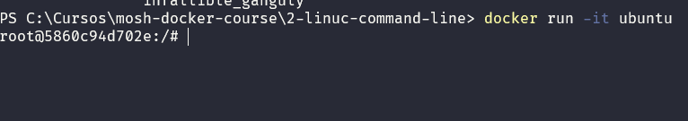
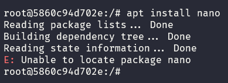

# The Linux Command Line

Let's go to Docker Hub and get the Ubuntu image:
https://hub.docker.com/_/ubuntu

## 1- Docker pull and Docker run

Instead of using the `docker pull ubuntu` command, you can use a shortcut: `docker run ubuntu`.
If docker doesn't find the image you specified in the command, it will first pull the image and then run it.

You will see that the container will stop running after it's pulled. To confirm this you can use the command `docker ps` that will give you the list of running processes.
If we run `docker ps -a` it will list all the processes, even those that are not running.

## 2 - Running commands in ubuntu

We can run the command `docker run -it ubuntu`, this will run the container in the interactive mode.

this will result in a shell. This will pick up our command and pass it to the operating system for execution.

If we run the command `echo $0` it will show us the location of the shell programm.

## 3 - apt package manager

`apt` is a package manager for linux (ubuntu in this case). It works similar to the `winget` from Windows.

In this case, we will install the package nano, that's a basic text editor for linux. So, to install it, we will run the following: `apt install nano`

After running this command, it will result on a error because the apt command cannot find a reference to the nano package, because it might not be installed, we can check that using the `apt list` command.
To solve this, we need to update the apt database using the command `apt update`.
So, before we isntall a package, we must first update the list/database of packages and then install the needed package.
To remove this package, you just need to run `apt remove nano`.

## 4- Most used commands that we are going to use

`pwd` - prints the current working directory
`ls` - prints the directory files
`ls -l` - prints the directory files in an more detailed way
